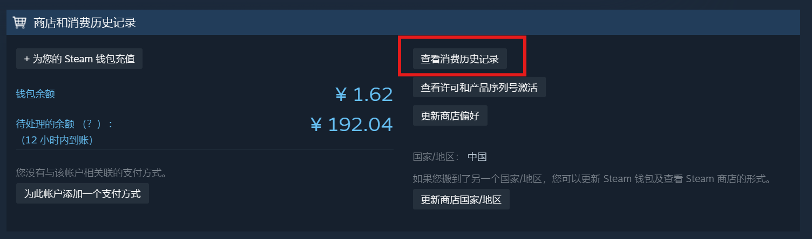

## 项目简介

本项目用于对从 Steam 导出的消费明细 `cost.md` 进行两类处理：

- **可读性优化**：将原始账单格式化为更适合阅读的 Markdown 文本。
- **消费统计**：基于后文详述的规则，估算自己在 Steam 上的实际累计花费（比小 High 盒更符合实际），和当前钱包余额（用于验算）。

## 文件结构

- `cost.md`：从 Steam 复制粘贴的原始消费记录（即输入文件）。
- `format_cost.py`：将 `cost.md` 转换为更易读的 `cost_formatted.md`。
- `cost_formatted.md`：格式化后的账单，仅用于人工查看，不涉及余额计算。
- `calc_cost.py`：根据 `cost.md` 计算累计成本和当前 Steam 钱包余额估计值。

## 使用方法

首先打开 Steam `账户明细`，点击 `查看消费历史记录`，向下滚动加载更多交易，直到显示全部交易为止。



在项目根目录（包含 `cost.md` 的目录）中打开终端或 PowerShell。

### 1. 生成格式化账单

保持 `cost.md` 为从 Steam 导出的原始内容，运行：

```bash
python format_cost.py
```

脚本会在同目录生成 `cost_formatted.md`，内容包括：

- 每条记录之间加入分隔线 `---`。
- 将制表符替换为 ` | `，方便在编辑器或 Markdown 预览中阅读。
- 为 `市场交易`、`购买`、`游戏内购买`、`资金`、`钱包`、`支付宝` 等关键字段加上列表标记。

此步骤不会修改原始的 `cost.md`。

### 2. 计算累计成本和 Steam 余额

确保 `cost.md` 未被手动改坏原有结构后，运行：

```bash
python calc_cost.py
```

脚本会直接读取 `cost.md`，在终端输出统计结果，包括：

- 市场交易获得余额总额。
- 将上述市场交易收入按九折折算得到的“市场交易成本”。  
  例如：如果通过市场出售获得 100 元，脚本认为当初购买这些物品的成本为 90 元。
- 支付宝 / 微信 / 银行卡等外部直付总额（包括直购游戏和直接充值）。
- 根据上述两部分合计得到的累计总成本。
- 根据账单记录中最新的一条三段金额记录，推断出的当前 Steam 钱包余额。

## 成本规则说明

成本计算遵循如下约定：

- **倒余额（市场交易）收入**：视为你用九折价购入物品再出售。自己倒余额的折扣通常更优，但是淘宝买余额会更劣，所以取了一个折衷的九折。
  - 市场中所有以 `+¥` 记账的收入会按 0.9 倍计入成本。
- **直充直购**：通过 `支付宝`、`微信支付`、`银行卡`、`银联`、`Visa`、`MasterCard` 等渠道发生的付款，按原金额计入成本。
  - 脚本会优先从同时包含支付方式关键字和金额的行中提取金额。
  - 若该记录只在单独一行列出金额（如某些游戏直购记录），则从不含“钱包 / 余额 / 变更”且无 `+¥ / -¥` 符号的金额行中提取。
  - 对类似“已购买 XX 钱包资金”的充值记录，如找不到更明确的金额行，则取含多笔金额行中的第一笔金额作为本次充值金额。

在不修改脚本逻辑的前提下，所有计算均基于 `cost.md` 当前的完整内容，不会对原始账单做任何写入操作。

## 环境要求

- Python 3.10 及以上版本（推荐 3.11+）。
